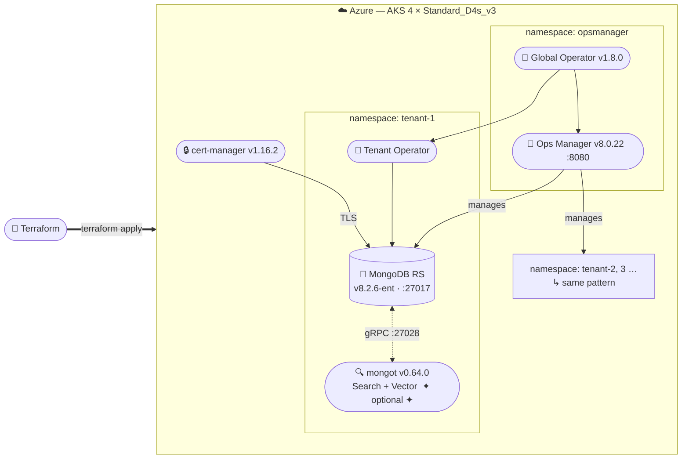

# MongoDB Ops Manager on Azure AKS — Multi-Tenant Deployment with Search (Optional)



## What This Deploys

| Component | Version | Namespace |
|---|---|---|
| MongoDB Kubernetes Operator (Helm chart) | 1.8.0 | `opsmanager` (global) + per-tenant |
| MongoDB Ops Manager | 8.0.22 | `opsmanager` |
| MongoDB Enterprise Server | 8.2.6-ent | `tenant-<name>` |
| MongoDB Search / Vector Search (optional) | bundled with 8.2.6 | `tenant-<name>` |
| cert-manager | v1.16.2 | `cert-manager` |

The global operator in `opsmanager` installs CRDs and manages the Ops Manager instance. Each tenant gets its own operator instance that watches only its namespace, providing strict isolation.

---

## Prerequisites

Install the following tools before starting:

```bash
# Azure CLI
brew install azure-cli         # macOS
az login                       # authenticate

# Terraform
brew install terraform

# kubectl
brew install kubectl

# Helm
brew install helm

# Verify versions
az version
terraform version              # >= 1.5.0
kubectl version --client
helm version                   # >= 3.x
```

Get your Azure subscription ID — you'll need it in the next step:

```bash
az account show --query id -o tsv
```

---

## Step 1 — Configure terraform.tfvars

```bash
cp terraform.tfvars.example terraform.tfvars
```

Open `terraform.tfvars` and set the required values. At minimum:

```hcl
subscription_id = "<your-azure-subscription-id>"

created_by  = "your.email@example.com"
expired_on  = "2026-12-31"
environment = "production"

cluster_name              = "aks-mongodb-cluster"
resource_group_name       = "mongodb-aks-thomas-rg"
ops_manager_allowed_cidrs = ["<your-public-ip>/32"]  # restrict access to Ops Manager port 8080

# Versions — already set to current defaults, update only if needed
kubernetes_operator_version = "1.8.0"
ops_manager_version         = "8.0.22"

# Ops Manager connection — fill in AFTER Ops Manager is running (Step 5)
# Leave as placeholders for now; Terraform does not fail on unused values
ops_manager_url        = "http://PLACEHOLDER:8080"
ops_manager_admin_user = "admin"
ops_manager_api_key    = "PLACEHOLDER"
```

Tenant configuration (Tenant 1 is pre-configured with Search enabled):

```hcl
tenants = {
  "tenant-1" = {
  ops_manager_user       = "PLACEHOLDER"   # set to the PUBLIC KEY  (acts as the API username)
  ops_manager_public_key = "PLACEHOLDER"   # set to the PRIVATE KEY (acts as the API password — shown once on creation)
    ops_manager_org_id     = "PLACEHOLDER"   # fill in after Step 5
    ops_manager_project_id = "PLACEHOLDER"   # fill in after Step 5
    cpu_quota              = "20"
    memory_quota           = "40Gi"
    storage_quota          = "200Gi"
    enable_search          = true
    mongodb_version        = "8.2.6-ent"
    mongodb_members        = 3
    search_cpu_limit       = "4"
    search_memory_limit    = "8Gi"
    search_cpu_request     = "3"
    search_memory_request  = "5Gi"
  }
}
```

---

## Step 2 — Deploy Infrastructure with Terraform

```bash
terraform init
```

Deploy in two stages because the Kubernetes/Helm providers need a running AKS cluster first:

```bash
# Stage 1: AKS cluster only (~10 minutes)
terraform apply -target=module.aks

# Stage 2: everything else — operator, cert-manager, tenant namespaces
terraform apply
```

Review the plan output before confirming each apply.

---

## Step 3 — Connect kubectl to the Cluster

```bash
az aks get-credentials --resource-group [resource_group_name] --name aks-mongodb-cluster

# Verify connection
kubectl get nodes
```

---

## Step 4 — Deploy Ops Manager

**Create the admin credentials secret first:**

```bash
kubectl create secret generic ops-manager-admin-secret \
  -n opsmanager \
  --from-literal=Username=admin \
  --from-literal=Password='<choose-a-strong-password>' \
  --from-literal=FirstName=Admin \
  --from-literal=LastName=User
```

**Deploy the Ops Manager custom resource:**

```bash
kubectl apply -f manifests/ops-manager-deployment.yaml
```

**Monitor the rollout** (this takes 5–15 minutes — Ops Manager pulls a large image and initialises an application database):

```bash
# Watch all pods come up
kubectl get pods -n opsmanager -w

# Check the OpsManager resource status (look for "Running" phase)
kubectl get opsmanagers -n opsmanager

# If a pod is stuck, check events
kubectl describe pod -n opsmanager <pod-name>
```

Expected final state:
```
NAME                                          READY   STATUS    RESTARTS
mongodb-enterprise-operator-<hash>            1/1     Running   0
ops-manager-0                                 1/1     Running   0
ops-manager-db-0                              1/1     Running   0
ops-manager-db-1                              1/1     Running   0
ops-manager-db-2                              1/1     Running   0
```

---

## Step 5 — Access Ops Manager UI and Create API Key

**Get the external IP:**

```bash
kubectl get svc -n opsmanager
# Look for the LoadBalancer service — note the EXTERNAL-IP
```

If no external IP is assigned yet (still `<pending>`), use port-forward:

```bash
kubectl port-forward svc/ops-manager-svc -n opsmanager 8080:8080
# Access at: http://localhost:8080
```

**First-time setup in the UI:**
1. Browse to `http://<EXTERNAL-IP>:8080`
2. Complete the registration wizard to create the initial admin account
3. Note down the **Organization ID** visible in the URL: `http://<host>/v2#/org/<ORG-ID>/...`

**Create a Global API Key for the tenant operator:**
1. Top-right menu → **Account** → **Public API Access**
2. Click **Generate** next to API Keys
3. Description: `Tenant 1 Operator`
4. Permissions: `Global Owner`
5. **Copy both the Public Key and Private Key** — the private key is shown only once
6. Click **Add Whitelist Entry** and add the following CIDRs to allow operator traffic from inside the cluster:
   - `10.0.0.0/8`
   - `172.16.0.0/12`
   - `192.168.0.0/16`

**Create an Ops Manager project for the tenant:**
1. In the left sidebar click **New Organization** (or use existing)
2. Inside the org, click **New Project** → name it `tenant-1-project`
3. Note the **Project ID** from the URL: `.../project/<PROJECT-ID>/...`

---

## Step 6 — Wire Tenant to Ops Manager

Now that you have the API key, org ID, and project ID, update `terraform.tfvars` with the real values:

> **API key naming:** Ops Manager gives you a **Public Key** (the identifier, used as the username) and a **Private Key** (the secret, shown only once). Despite the confusing variable names, `ops_manager_user` takes the Public Key and `ops_manager_public_key` takes the Private Key.

```hcl
"tenant-1" = {
  ops_manager_user       = "<Public-Key>"   # the key identifier — looks like: abcdefgh
  ops_manager_public_key = "<Private-Key>"  # the key secret   — looks like: xxxxxxxx-xxxx-xxxx-xxxx-xxxxxxxxxxxx
  ops_manager_org_id     = "<Org-ID>"
  ops_manager_project_id = "<Project-ID>"
  ...
}
```

Also update the top-level `ops_manager_url` to the actual external IP:

```hcl
ops_manager_url = "http://<EXTERNAL-IP>:8080"
```

Re-run Terraform to propagate the values into the tenant credentials secret and Ops Manager ConfigMap:

```bash
terraform apply
```

Alternatively, create the secret and configmap directly with kubectl (no re-apply needed):

```bash
# Credentials secret
# ops_manager_user       = Public Key  (the API key identifier)
# ops_manager_public_key = Private Key (the API key secret)
kubectl create secret generic tenant-1-ops-manager-credentials \
  -n tenant-1 \
  --from-literal=user=<Public-Key> \
  --from-literal=publicApiKey=<Private-Key>

# Connection configmap
kubectl create configmap tenant-1-ops-manager-config \
  -n tenant-1 \
  --from-literal=baseUrl=http://ops-manager-svc.opsmanager.svc.cluster.local:8080 \
  --from-literal=projectName=tenant-1-project \
  --from-literal=orgId=<Org-ID>
```

---

## Step 7 — Deploy the Tenant 1 MongoDB Replica Set

```bash
kubectl apply -f manifests/tenant-1-mongodb.yaml
```

Monitor until all 3 members are `Running` (5–10 minutes):

```bash
kubectl get pods -n tenant-1 -w

# Detailed status including operator reconciliation messages
kubectl describe mongodb tenant-1-mongodb -n tenant-1
```

Confirm in Ops Manager UI: **Deployment** → **Clusters** — the `tenant-1-mongodb` replica set should appear.

---

## Step 8 — Enable MongoDB Search for Tenant 1 (Optional)

MongoDB Search is a Preview feature requiring MongoDB Enterprise 8.2.0+ and TLS. TLS is already enabled in `tenant-1-mongodb.yaml` and the required certs were provisioned by Terraform in Step 2.

```bash
# Deploy the MongoDBSearch custom resource
kubectl apply -f manifests/tenant-1-mongodb-search.yaml

# Watch for Running status (~3 minutes)
kubectl get mongodbsearch tenant-1-mongodb -n tenant-1 -w
```

**To disable Search** (the replica set continues running):

```bash
kubectl delete -f manifests/tenant-1-mongodb-search.yaml
```

---

## Step 9 — Create a Database User and Connect from Your Mac

### Create a database user

In the Ops Manager UI, navigate to your **tenant-1-project** deployment, then go to **Security** → **Database Users** → **Add New User**.

Fill in the form:

| Field | Value |
|---|---|
| **Identifier** — left box *(database)* | `admin` |
| **Identifier** — right box *(name)* | `appuser` |
| **Roles** | `readWriteAnyDatabase@admin` |
| **Password** | choose a password and note it |
| **Authentication Mechanisms** | check **SCRAM-SHA-256** only |

Leave Authentication Restrictions empty. Click **Add User** → **Review & Deploy** → **Confirm & Deploy**.

Wait ~30 seconds for Ops Manager to push the user to the replica set.

### Port-forward to the replica set

The `tenant-1-mongodb-svc` service is a headless `ClusterIP` (no external IP). Port-forward from your Mac into a specific pod — keep this terminal open while you connect:

```bash
kubectl port-forward pod/tenant-1-mongodb-0 27017:27017 -n tenant-1
```

### Extract the CA certificate (one-time)

The replica set uses a self-signed CA provisioned by cert-manager. Download it so your client can verify the TLS connection:

```bash
kubectl get configmap tenant-1-ca-configmap \
  -n tenant-1 \
  -o jsonpath='{.data.ca\.crt}' > /tmp/tenant-1-ca.crt
```

### Connect with mongosh

```bash
mongosh "mongodb://appuser:<password>@localhost:27017/admin?directConnection=true" \
  --tls \
  --tlsCAFile /tmp/tenant-1-ca.crt
```

> **Note:** `directConnection=true` must be in the URI (not a CLI flag). It bypasses replica set discovery, which is required because the cluster-internal hostnames (`tenant-1-mongodb-0`, `*.svc.cluster.local`) don't resolve on your Mac.

### Connect with MongoDB Compass

1. Open Compass → **New Connection** → **Advanced Connection Options**
2. **General** tab:
   - Host: `localhost`
   - Port: `27017`
   - Direct Connection: **checked**
3. **Authentication** tab:
   - Username: `appuser`, Password: `<password>`, Auth DB: `admin`
4. **TLS/SSL** tab:
   - TLS: **On**
   - Certificate Authority: browse to `/tmp/tenant-1-ca.crt`
5. Click **Connect**

Or use the URI directly in the connection string box and set the CA file under TLS/SSL:
```
mongodb://appuser:<password>@localhost:27017/admin?authSource=admin&directConnection=true&tls=true
```

### Verify you're on the primary

```javascript
db.hello()   // isMaster: true means you're on the primary
rs.status()  // shows all 3 replica set members
```

To connect to a different member, change the pod number in the port-forward command (`tenant-1-mongodb-1` or `tenant-1-mongodb-2`) and reconnect.

---

## Managing Tenants

### Add a tenant

Add an entry to `tenants` in `terraform.tfvars`:

```hcl
"newtenant" = {
  ops_manager_user       = "<Public-Key>"
  ops_manager_public_key = "<Private-Key>"
  ops_manager_org_id     = "<Org-ID>"
  ops_manager_project_id = "<Project-ID>"
  cpu_quota              = "10"
  memory_quota           = "20Gi"
  storage_quota          = "100Gi"
}
```

Then: `terraform apply`

This creates namespace `tenant-newtenant` with resource quotas, network policies, and a per-tenant operator. Deploy a MongoDB custom resource the same way as Steps 6–7.

### Remove a tenant

Remove the entry from `terraform.tfvars` and run `terraform apply`.

> **Warning**: This deletes the namespace and **all data within it**. Back up first.

---

## Verifying the Full Stack

```bash
# cert-manager
kubectl get pods -n cert-manager
kubectl get clusterissuers

# Ops Manager + global operator
kubectl get pods -n opsmanager
kubectl get opsmanagers -n opsmanager

# Tenant: namespaces, operator, MongoDB, Search
kubectl get namespaces | grep tenant-
kubectl get all -n tenant-1
kubectl get mongodb,mongodbsearch -n tenant-1

# Resource quotas per tenant
kubectl describe resourcequota -n tenant-1

# TLS certificates (when Search is enabled)
kubectl get certificates -n tenant-1
kubectl get secrets -n tenant-1 | grep tls
```

---

## Troubleshooting

### Ops Manager stuck in Pending

```bash
kubectl describe opsmanagers ops-manager -n opsmanager
kubectl get events -n opsmanager --sort-by='.lastTimestamp'
kubectl logs -n opsmanager -l app=mongodb-enterprise-operator --tail=100
```

### MongoDB replica set not reconciling

```bash
# Check the per-tenant operator logs
kubectl logs -n tenant-1 -l app=mongodb-enterprise-operator --tail=100

# Check the MongoDB resource status
kubectl describe mongodb tenant-1-mongodb -n tenant-1

# Common cause: secret or configmap missing / wrong keys
kubectl get secret tenant-1-ops-manager-credentials -n tenant-1 -o yaml
kubectl get configmap tenant-1-ops-manager-config -n tenant-1 -o yaml
```

### Search stuck not Running

```bash
kubectl describe mongodbsearch tenant-1-mongodb -n tenant-1
kubectl get events -n tenant-1 --sort-by='.lastTimestamp'

# Check TLS certs are ready
kubectl get certificate -n tenant-1
kubectl describe certificate tenant-1-search-tls -n tenant-1
```

### API key whitelist errors in operator logs

Add the pod CIDR of your AKS cluster to the Ops Manager API key whitelist:

```bash
# Find the pod CIDR
kubectl get nodes -o jsonpath='{.items[*].spec.podCIDR}'
```

Then add that range to the API key's access list in the Ops Manager UI.

---

## Repository Structure

```
.
├── main.tf                        # Root Terraform — wires all modules together
├── variables.tf                   # Input variable definitions and defaults
├── outputs.tf                     # Terraform outputs (cluster name, versions, etc.)
├── terraform.tfvars               # Your values (not committed)
├── terraform.tfvars.example       # Template to copy
├── manifests/
│   ├── ops-manager-deployment.yaml        # MongoDBOpsManager CR (v8.0.22)
│   ├── tenant-1-mongodb.yaml             # MongoDB ReplicaSet CR (v8.2.6-ent) with TLS
│   ├── tenant-1-mongodb-search.yaml      # MongoDBSearch CR — apply to enable Search
│   └── tenant-1-ops-manager-config.yaml  # ConfigMap + Secret template (reference only)
└── modules/
    ├── aks/                       # AKS cluster (4× Standard_D4s_v3)
    ├── cert-manager/              # cert-manager + self-signed CA + ClusterIssuers
    ├── mongodb-operator/          # Enterprise Operator Helm release + CRD install
    └── tenant-namespace/          # Namespace, quotas, network policy, operator, Search
```

---

## Clean Up

```bash
terraform destroy
```

> **Warning**: Destroys the AKS cluster, all namespaces, and all persistent volumes. This is irreversible.

---

## References

- [MongoDB Kubernetes Operator docs](https://www.mongodb.com/docs/kubernetes-operator/current/)
- [MongoDBSearch CR reference](https://www.mongodb.com/docs/kubernetes-operator/current/reference/mongodb-search-specification/)
- [MongoDB Ops Manager docs](https://www.mongodb.com/docs/ops-manager/current/)
- [Terraform AzureRM provider](https://registry.terraform.io/providers/hashicorp/azurerm/latest/docs)
